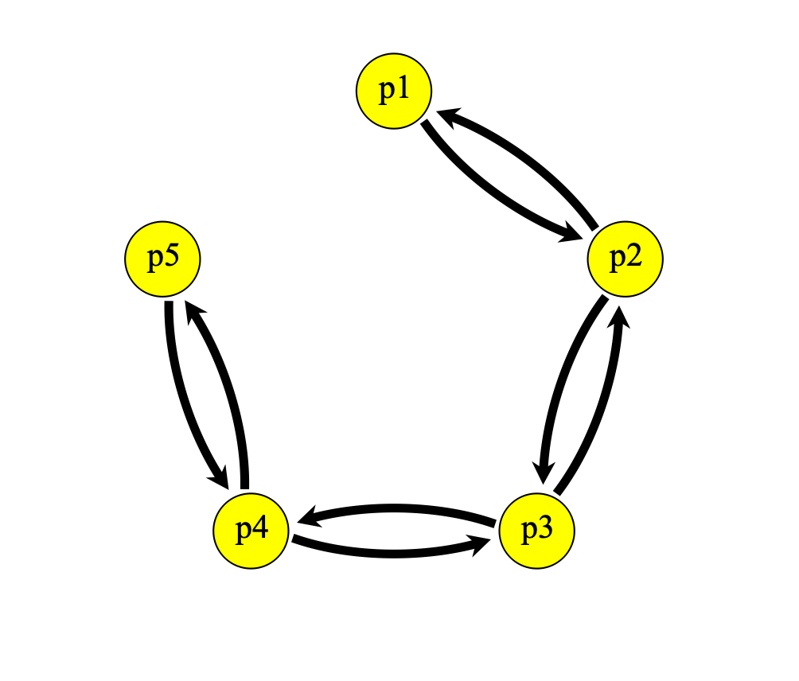

# NNPopAssign
Neural network for population assignment.

This project shows how to use neural networks with to perform population assignment with genetic data. I test the neural network classification on simulated genomic data with SLiM3. For the most basic test, I simulated a 5 population stepping stone model.

